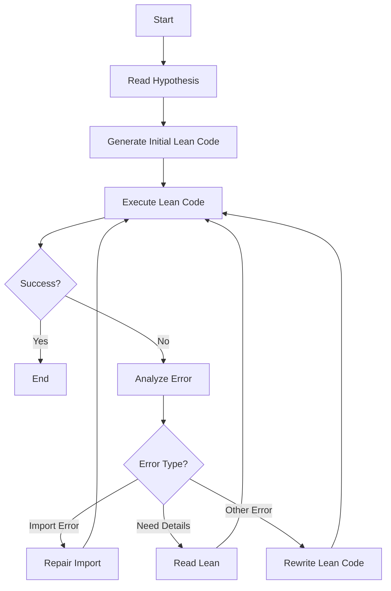

# Auto Verify Math with Lean4

This project provides a Python script to automatically verify mathematical hypotheses using Lean4. The script interacts with the Lean4 environment, generates Lean code, and iteratively refines it based on execution results.

## Features

- **Automatic Lean Code Generation**: Generates Lean code based on a given hypothesis.
- **Error Handling**: Automatically repairs import errors and rewrites Lean code based on execution results.
- **Integration with Mathlib**: Utilizes the Mathlib library for Lean4 to verify mathematical statements.

## Installation

### Prerequisites

1. **Lean4 Installation**: Follow the instructions from [this guide](https://blog.csdn.net/m0_52111823/article/details/145434011?spm=1001.2014.3001.5501) to install Lean4 on your system.

2. **Python Environment**: Ensure you have Python 3.7 or later installed.

### Setup

1. Clone this repository:
   ```bash
   git clone https://github.com/your-repo/auto-verify-math.git
   cd auto-verify-math
   ```

## Usage

To use the script, provide a hypothesis file and a Lean code file as arguments:

```bash
python verifyMath.py <hypothesis_file> <lean_code_file>
```

## Workflow

The following flowchart illustrates the workflow of the script:



